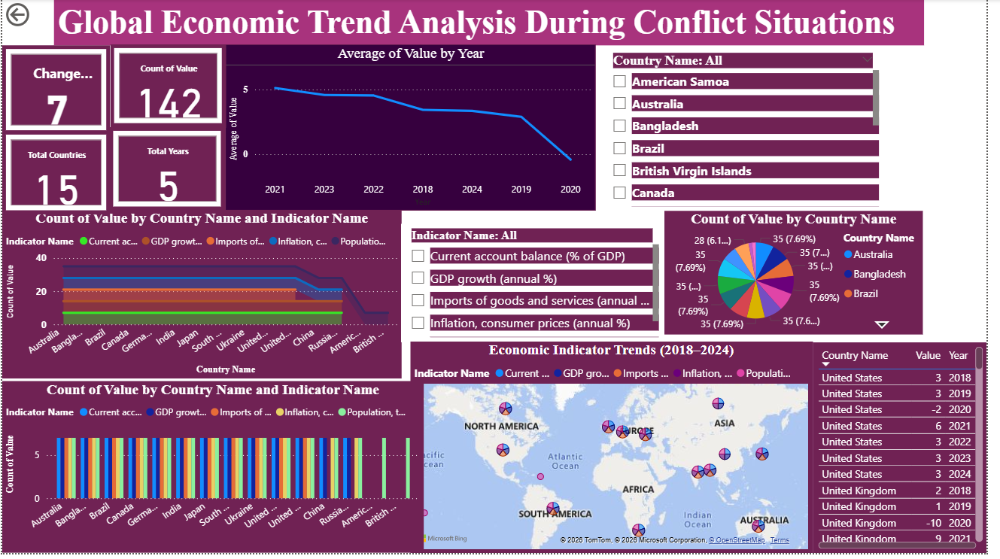

# Global-Economic-Trend-Analysis-During-Conflict-Situations
This project develops a Global Economic Trend Analysis Dashboard using Microsoft Power BI. Using data from the World Bank (2018–2024), it visualizes indicators like GDP growth, inflation, imports, and current account balance. Interactive charts and slicers help compare economic trends across countries.

**Dataset**

The dataset used in this project is obtained from the World Bank. It includes economic indicators for multiple countries covering the period 2018–2024.

Key Indicators Used

GDP Growth (Annual %)

Inflation (Consumer Prices)

Imports of Goods and Services (Annual % Growth)

Current Account Balance (% of GDP)

Population

**Tools and Technologies**

Microsoft Power BI

Power Query Editor

CSV / Excel Dataset

**Data Processing**

Before creating the dashboard, the dataset was cleaned and transformed using the following steps:

Removed missing or null values

Corrected inconsistent data formats

Transformed the dataset using unpivot operations

Organized the data into structured columns (Country, Indicator, Year, Value)

These preprocessing steps ensure that the dataset is suitable for analysis and visualization.

**Dashboard Features**

The Power BI dashboard includes multiple visualizations to analyze global economic trends:

Line Charts to analyze trends across years

Bar Charts to compare economic indicators between countries

Pie Charts to visualize distribution of economic indicators

Card Visuals showing summary statistics

Slicers for interactive filtering by country and indicator

## Dashboard Preview

